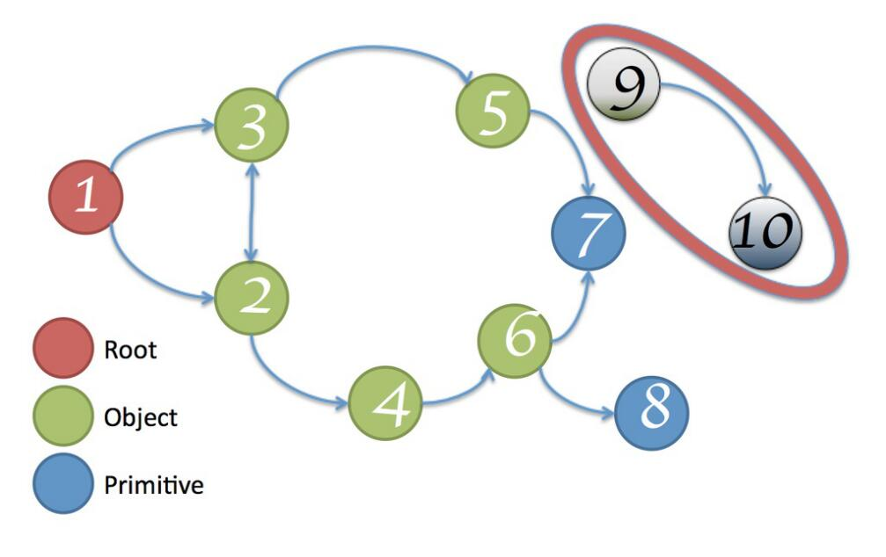

# 概述
**内存泄漏**指由于疏忽或错误造成程序**未能释放**已经不再使用的内存。  
*JavaScript的垃圾回收机制：V8在运行时自动回收不再需要使用的对象内存。基于根不可达来回收不使用的内存。如下图*
  
9，10无法被访问到，可以被回收了。
如何定义
接下来我们通过一个JS内存泄露实例（[A surprising JavaScript memory leak found at Meteor](https://blog.meteor.com/)）来分析探讨。
# 环境工作
## 1. 执行命令：npm install 安装依赖[heapdump](https://www.npmjs.com/package/heapdump)
heapdump记录当前的堆内存（heap）快照，即JS运行所用到的所有对象，对象所占用的内存大小，引用关系等。
## 2. 执行命令：npm run dev  运行测试程序
```javascript
let heapdump = require("heapdump");
let fs = require("fs");

let theThing = null;
let replaceThing = function () {
    let originalThing = theThing;
    let unused = function () {
        if (originalThing)
            console.log("hi");
    };
    theThing = {
        longStr: new Array(10000).join('*'),
        someMethod: function () {
            console.log(1111);
        }
    };

    //创建heap-snapshot文件夹
    fs.mkdir('./heap-snapshot/', ()=>{
        console.info("dump dir created");
    });

    //记录堆快照
    heapdump.writeSnapshot('./heap-snapshot/' + Date.now() + '.heapsnapshot', () => {
        console.log("heap snapshot file has been saving");
    })
};
 
setInterval(replaceThing, 1000);
```
上述代码是测试程序的主要运行逻辑。setInterval定时器每1000ms调用replaceThing方法，通过heapdump.writeSnapshot记录下每次执行的堆快照。
## 3. 在heap-snapshot文件夹中生成内存快照
运行测试程序之后，在heap-snapshot文件夹中生成了.heapsnapshot后缀的内存快照。
## 4. 可通过heap-snapshot文件夹中的内存快照分析内存泄漏问题
# 内存快照分析
# 结论


