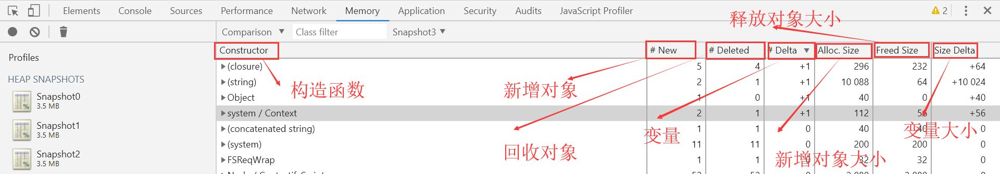
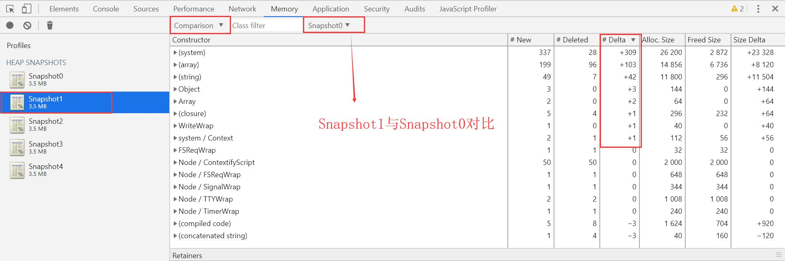
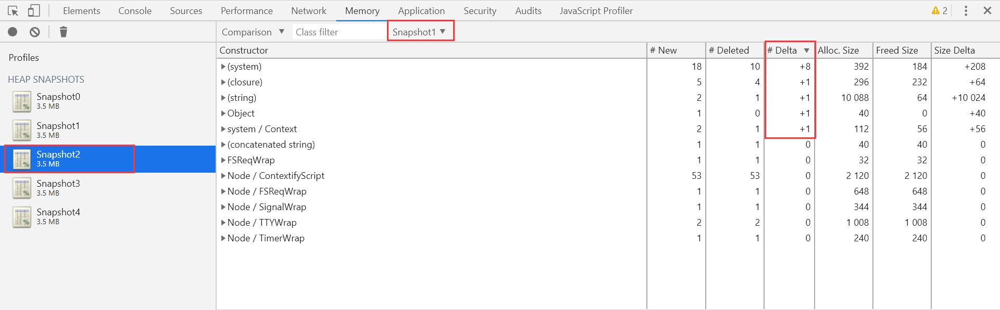
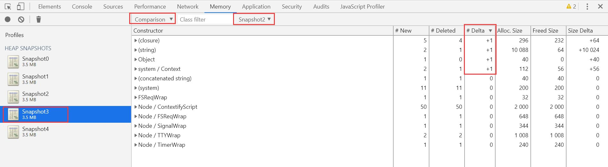
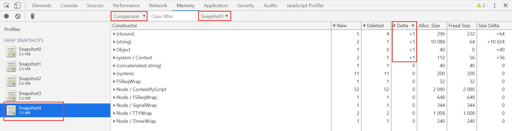
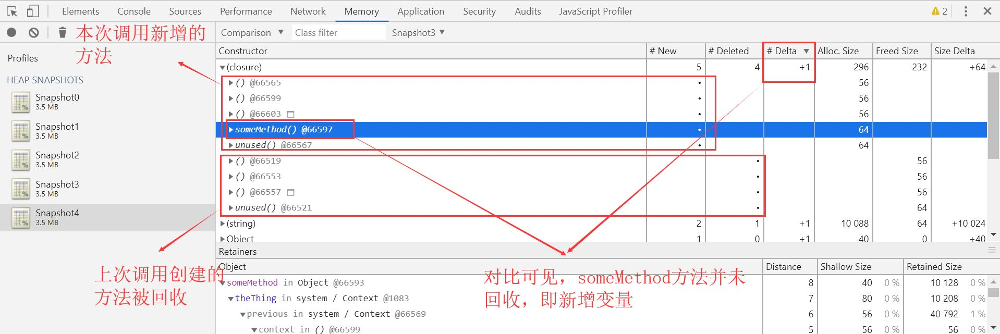
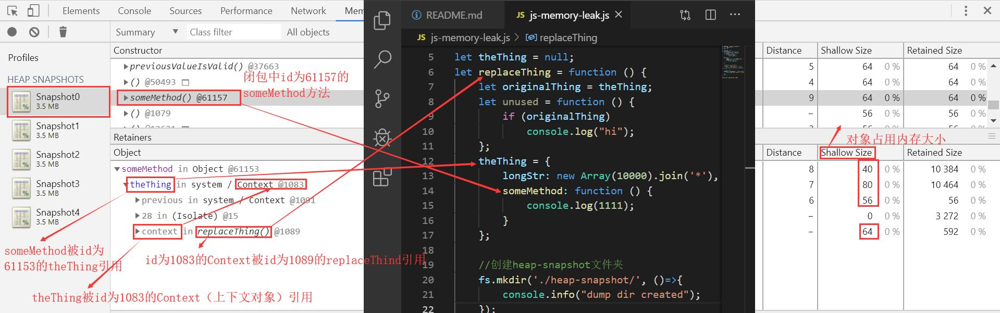

# 概述
**内存泄漏** 指由于疏忽或错误造成程序 **未能释放** 已经不再使用的内存。  
JavaScript的垃圾回收机制：**V8在运行时自动回收不再需要使用的对象内存，基于根不可达来回收不使用的内存。** 如下图
  
沿着1这个根对象的引用链往下走，9，10无法被访问到，可以被回收了。  
接下来我们通过一个JS内存泄露实例（[A surprising JavaScript memory leak found at Meteor](https://blog.meteor.com/)）来分析探讨。
# 准备工作
## 1. 执行命令：npm install 安装依赖[heapdump](https://www.npmjs.com/package/heapdump)
heapdump记录当前的堆内存（heap）快照，即JS运行所用到的所有对象，对象所占用的内存大小，引用关系等。
## 2. 执行命令：npm run dev  运行测试程序
```javascript
let heapdump = require("heapdump");
let fs = require("fs");
let num = 0;

let theThing = null;
let replaceThing = function () {
    let originalThing = theThing;
    let unused = function () {
        if (originalThing)
            console.log("hi");
    };
    theThing = {
        longStr: new Array(10000).join('*'),
        someMethod: function () {
            console.log(1111);
        }
    };

    //创建heap-snapshot文件夹
    fs.mkdir('./heap-snapshot/', ()=>{
        console.info("dump dir created");
    });

    //记录堆快照
    heapdump.writeSnapshot('./heap-snapshot/' + 'Snapshot'+ num + '.heapsnapshot', () => {
        console.log("heap snapshot file has been saving");
    })
    num ++;
};
 
setInterval(replaceThing, 1000);
```
上述代码是测试程序的主要运行逻辑。setInterval定时器每1000ms调用replaceThing方法，通过heapdump.writeSnapshot记录下每次执行的堆快照。
## 3. 在heap-snapshot文件夹中生成内存快照
运行测试程序之后，在heap-snapshot文件夹中生成了.heapsnapshot后缀的内存快照。打开谷歌浏览器，F12快捷键调出控制台，选择Memory面板，在面板左侧点击鼠标右键，选择需要分析的内存快照，将其加载进来，如下图：
  
# 内存快照分析
## 1. 对比heap-snapshot文件夹中的内存快照
切换到Comparison视图，通过比较多个快照之间的差异来找出内存泄露的对象。
  
上图对比结果的列表中，我们重点关注的是变量（#Delta）的值，每次调用replaceThing方法的时候，新增的对象个数。    
Snapshot0与Snapshot1对比如下：  
  
Snapshot1与Snapshot2对比如下：  
  
Snapshot2与Snapshot3对比如下：  
  
Snapshot3与Snapshot4对比如下：  
  
通过多次对比，每次调用replaceThing方法，<kbd>(closure)</kbd>，<kbd>(string)</kbd>，<kbd>Object</kbd>，<kbd>system/Context</kbd> 四者的内存都会稳定增加。
## 2. 对比结果分析
### 1. closure(闭包)
首先分析closure的堆内存：
    

接下来分析闭包中的someMethod方法，下图是第一次调用replaceThing方法获取的堆快照：
  
如上图，someMethod@61157被theThing@61153引用，展开theThing@61153这个对象之后，可以看到：（1）它被Content@1083（即replaceThing函数上下文对象）引用；（2）previous在这里指：调用theThing@61153前一次的theThing（即replaceThing方法外定义的theThing<kbd>let theThing = null;</kbd>）；（3）previous被Content@1091（即replaceThing函数外的上下文对象）引用，Content@1083被repleceThing@1089引用。  
总结：有两个theThing的引用未释放，即theThing@61153与previous（<kbd>let theThing = null;</kbd>）

### 2. string
### 3. Object
### 4. system/Context
# 结论


